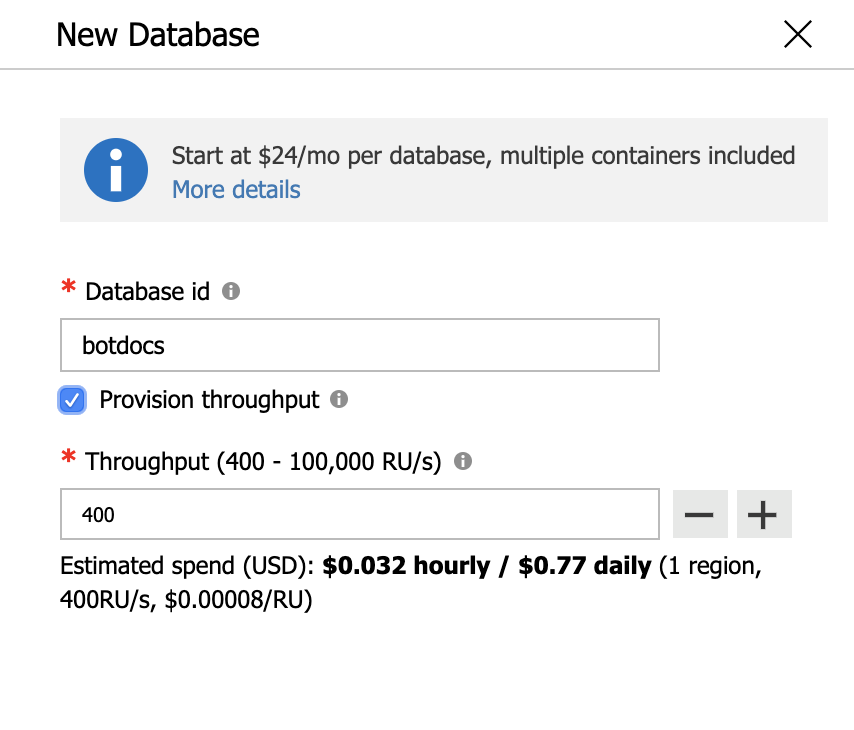
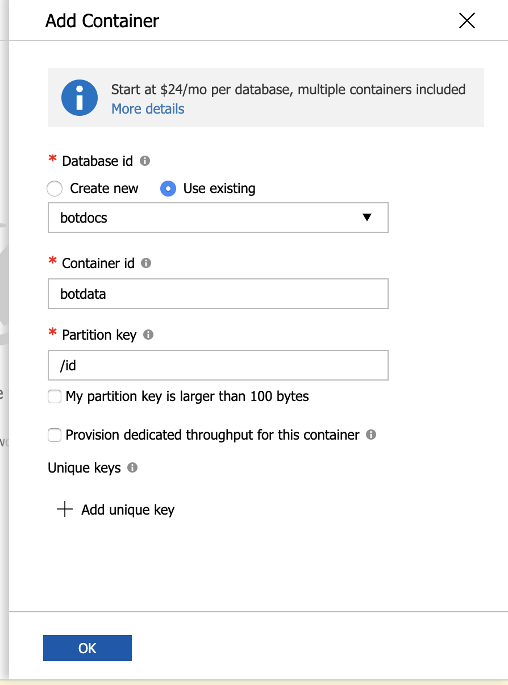
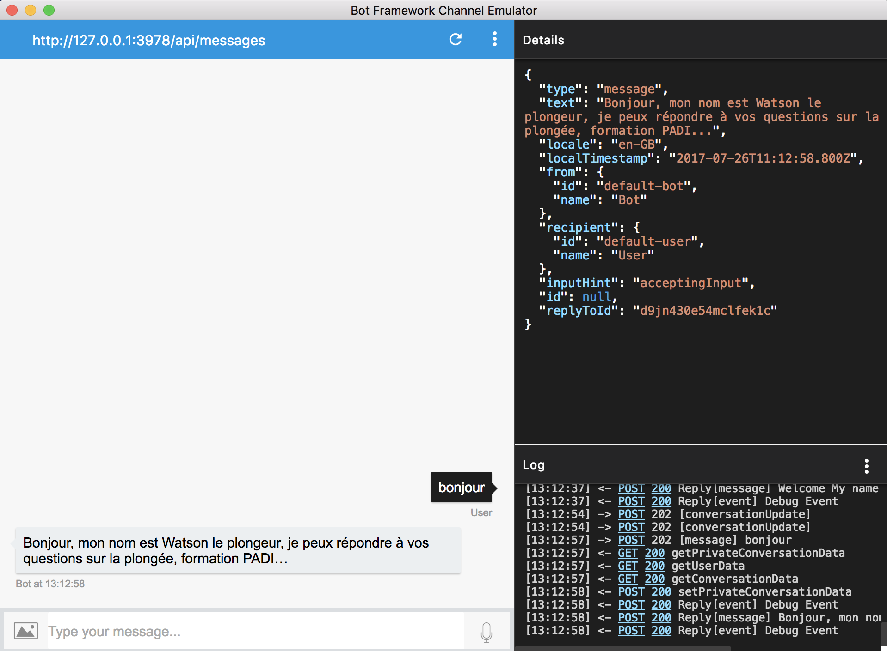
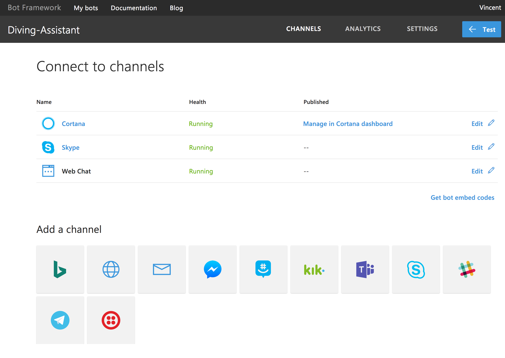
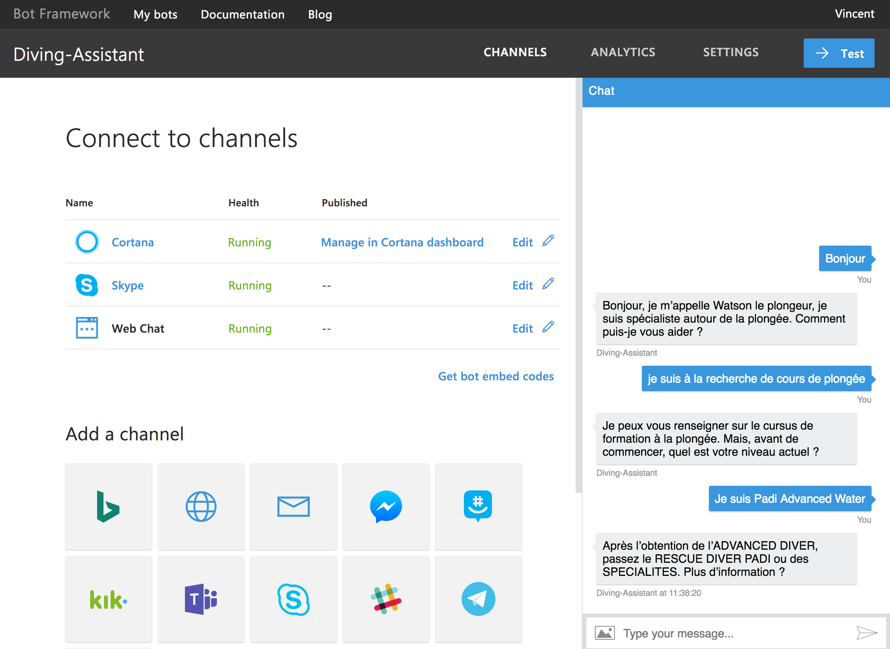
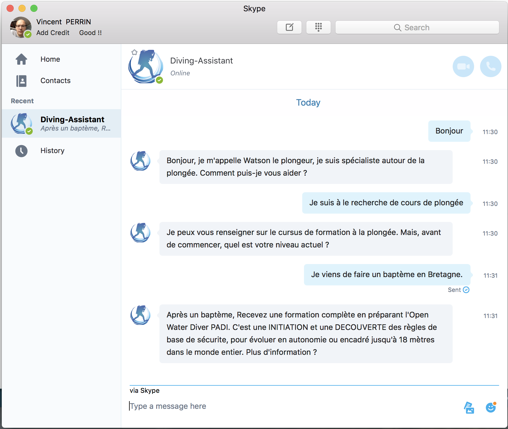

# A Microsoft Bot Framework & IBM Watson Bot sample

A sample bot using Microsoft Bot framework as communication channel support and IBM Watson Conversation

[](https://bluemix.net/deploy?repository=https://github.com/vperrinfr/Cortana-Watson)

## Introduction

The Microsoft Bot Framework provides just what you need to build and connect intelligent bots that interact naturally wherever your users are talking, from text/sms to Skype, Slack, Office 365 mail and other popular services. [More details](https://dev.botframework.com/)

IBM Watson Conversation service help you to quickly build and deploy chatbots and virtual agents across a variety of channels, including mobile devices, messaging platforms, and even robots. [More details](https://www.ibm.com/watson/services/conversation/)

Why using Microsoft Bot Framework & IBM Watson : **Openess**
- Watson Conversation is channel-agnostic. IBM provided native integration with Slack and integration with [BotKit](https://www.botkit.ai/).
- Microsoft Bot Framework opens Watson to the Microsoft world via its integration with Skype, Bing, Cortana, Office365 Mail, Microsoft Teams...https://docs.microsoft.com/en-us/bot-framework/portal-configure-channels

## Prerequisites

The minimum prerequisites to run this sample are:
* Create a Bluemix account & a Watson Conversation Workspace
    * In case, you don't have it : [Sign up](https://console.ng.bluemix.net/registration/?target=/catalog/%3fcategory=watson) in Bluemix, or use an existing account
$ Acquire Watson Conversation credentials

   * The code needs you to provide the username, password, and workspace_id of your Watson Conversation chat bot. If you have an existing Conversation service instance, [follow these steps](https://github.com/watson-developer-cloud/conversation-simple/blob/master/README.md#configuring-the-application-environmnet) to get your credentials. If you do not have a Conversation service instance, [follow these steps](https://github.com/watson-developer-cloud/conversation-simple/blob/master/README.md#before-you-begin) to get started.
    
* Latest Node.js with NPM. Download it from [here](https://nodejs.org/en/download/).
* The [Cloud Foundry][cloud_foundry] command-line client

      Note: Ensure that you Cloud Foundry version is up to date

  ```
  Note: When pushing to cloud foundry you must explicitly specify what buildpack to use i.e. 

  cf push -b https://github.com/cloudfoundry/nodejs-buildpack
  ```

* The Bot Framework Emulator. To install the Bot Framework Emulator, download it from [here](https://emulator.botframework.com/). Please refer to [this documentation article](https://github.com/microsoft/botframework-emulator/wiki/Getting-Started) to know more about the Bot Framework Emulator.
* Register your bot with the Microsoft Bot Framework. Please refer to [this](https://docs.microsoft.com/en-us/bot-framework/portal-register-bot) for the instructions. Once you complete the registration, update your bot configuration with the registered config values (See [Debugging locally using ngrok](https://docs.microsoft.com/en-us/bot-framework/debug-bots-emulator) or [Deploying to IBM Bluemix](https://console.bluemix.net/docs/runtimes/nodejs/getting-started.html#getting-started-with-node-js-on-bluemix))

* Set up your Azure storage with the following steps.
  * Create an Azure account if you dod not already have one. This should be the account that you used for creating your bot
  * Create a CosmoDB database inside that account named _botdocs_  
   
  * Inside that database, create a collection named _botdata_ make sure that the partition key is _id_
   
  * Make a note of the _PRIMARY KEY_ associated with your account. This must be stored in the environment file as _storageKey_
  * Take note of the URI associated with your bot account, It will be something like :
https://<bot_name>.documents.azure.com:443/ - this will be the _storageURL_ you will save in your environment file below.

## Instructions

* Copy or rename the .env_example file to .env (nothing before the dot) and add your Watson conversations details and Microsoft Bot app keys.

```
# Environment variables
WORKSPACE_ID=
CONVERSATION_USERNAME=
CONVERSATION_PASSWORD=
#Microsoft Bot Info
appId=
appPassword=
storageKey=
storageURL=
```

* Before deploying that code, I recommend you fork it to test it locally with BotFramework emulator. [more details](https://docs.microsoft.com/en-us/bot-framework/debug-bots-emulator)



## Code Explanation

Watson Conversation Node.js code :
I retrieve the Bot session message, pass that message to Watson Conversation, retrieve the response and send back the response to Bot session.

```Javascript
var bot = new builder.UniversalBot(connector, function (session) {

    var payload = {
        workspace_id: workspace,
        context:'',
        input: { text: session.message.text}
    };

   // I use the Bot Conversation Id as identifier.
    var conversationContext = findOrCreateContext(session.message.address.conversation.id);	
    if (!conversationContext) conversationContext = {};
    payload.context = conversationContext.watsonContext;

    conversation.message(payload, function(err, response) {
     if (err) {
       session.send(err);
     } else {
       console.log(JSON.stringify(response, null, 2));
       session.send(response.output.text);
       conversationContext.watsonContext = response.context;
     }
    });

});
```

I have a specific function to handle the conversation context.
```Javascript
function findOrCreateContext (convId){
      // Let's see if we already have a session for the user convId
    if (!contexts)
        contexts = [];
        
    if (!contexts[convId]) {
        // No session found for user convId, let's create a new one
        //with Michelin concervsation workspace by default
        contexts[convId] = {workspaceId: workspace, watsonContext: {}};
        //console.log ("new session : " + convId);
    }
return contexts[convId];
}
```

## Results

Channels supported by Bot Framework


My bot tested with Bot Framework test client


My conversation with Watson via Microsoft Skype


## More Information

To get more information about how to get started, please review the following resources:
* [IBM Bluemix](https://www.ibm.com/cloud-computing/bluemix/)
* [Watson Developer Cloud](https://www.ibm.com/watson/developer/)
* [Watson Conversation](https://www.ibm.com/watson/services/conversation/)
* [Microsoft Bot Builder for Node.js Reference](https://docs.microsoft.com/en-us/bot-framework/nodejs/)
* [Bot Framework FAQ](https://docs.microsoft.com/en-us/bot-framework/resources-bot-framework-faq#i-have-a-communication-channel-id-like-to-be-configurable-with-bot-framework-can-i-work-with-microsoft-to-do-that)

